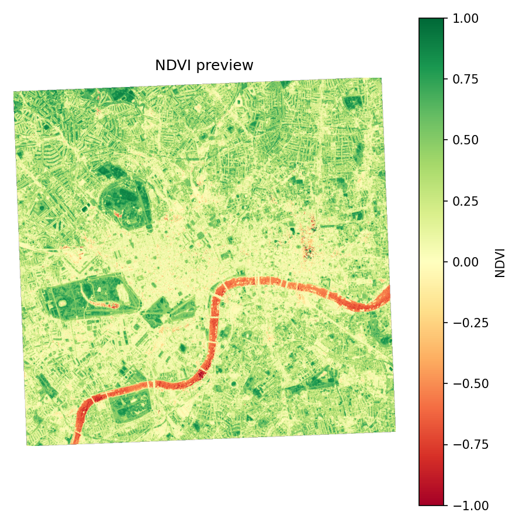

# Sentinel-2 NDVI Mini-Pipeline (GDAL + GeoPandas + Rasterio)

A small end-to-end Earth Observation project that:
- downloads Sentinel-2 L2A bands via GDAL from public Cloud-Optimized GeoTIFFs (COGs),
- clips to an AOI polygon,
- computes NDVI,
- exports an analysis-ready GeoTIFF and a quick PNG preview.

## What this project demonstrates
- GDAL-based remote raster access + warping
- AOI-driven clipping (GeoJSON)
- Raster index computation (NDVI)
- Reproducible, script-based workflow
- Outputs ready for GIS or downstream ML

## Repo structure
- `aoi/` AOI polygon (GeoJSON)
- `scripts/` pipeline scripts
- `data/` local clipped bands (ignored by git)
- `output/` results (ignored by git)

## Run the pipeline (Windows + conda)

### 1) Create environment
```bash
conda create -n ndvi python=3.12 -y
conda activate ndvi
conda install -c conda-forge gdal rasterio geopandas shapely pyproj fiona numpy matplotlib -y
```

## Results

Example NDVI output generated from Sentinel-2 L2A imagery after AOI clipping and reprojection to UTM.



### Notes
- NDVI computed using Sentinel-2 B04 (Red) and B08 (NIR) bands
- Explicit nodata handling to avoid AOI edge artefacts
- Output GeoTIFF is analysis-ready for GIS or downstream modelling

## Lessons learned

- **COGs + GDAL are faster than downloading full scenes:** Streaming remote COGs and clipping early kept the workflow lightweight and repeatable.
- **Projection matters for pixel math:** Reprojecting to UTM (EPSG:32630) avoided distortions and ensured consistent pixel sizing for the AOI.
- **Band naming varies across catalogs:** STAC assets may expose bands as `red/nir` rather than `B04/B08`, so inspecting asset keys is essential.
- **Nodata handling is not optional:** Explicit nodata masking prevents NDVI artefacts at AOI boundaries and in areas with missing pixels.